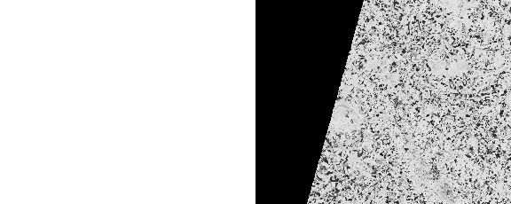

#  horizontal mosaicking of two different orbits

This is some sort of "proof-of-concept" for the mosaic problem we have.
I didn't have any suitable S1 images ready, so I tested it on S2, and it seems
to work.

Some notes:
* For identifying the overlap area, I **only** rely on the out-of-orbit (=nodata) value; no spatial information from the footprints/databases etc. is used. If this specified value occurs somewhere else in the image, results
  will probably be weird.

* Images have to have the same **projection**, the same **height** and **overlap exactly
  in north-south direction**. East-West can be different.
* It is possible to apply some sort of "buffer" to the overlap area to remove
  unwanted border pixels.
* It can be only used for **two** input images.
* It can only be used to blend images together **horizontally**.

## Usage

This script can be used from the command line or imported into python scripts.

    usage: horizontal_blending.py [-h] [-ooo_A VALUE] [-ooo_B VALUE]
                                [-o OUTPUT_FILE] [-b BUFFER_SIZE_PIXEL]
                                image_A image_B

    horizontal seamless mosaicking of two images

    positional arguments:
    image_A               Image A
    image_B               Image B

    optional arguments:
    -h, --help            show this help message and exit
    -ooo_A VALUE, --out_of_orbit_A VALUE
                            Out-of-orbit value for Image A
    -ooo_B VALUE, --out_of_orbit_B VALUE
                            Out-of-orbit value for Image B
    -o OUTPUT_FILE, --output_file OUTPUT_FILE
                            /path/to/output_file
    -b BUFFER_SIZE_PIXEL, --buffer_size_pixel BUFFER_SIZE_PIXEL
                            size of border to remove (in pixel)


or

```python
from horizontal_blending import horizontal_blending

horizontal_blending(image_A: str,
                    image_B: str,
                    output_file: str = None,
                    nodata_A: int = 0,
                    nodata_B: int = 0,
                    buffer_size_pixel: int = None) -> str:

```

## Examples


#### Image 1


#### Image 2


#### merged without blending


#### merged with blending


## Sigmoid functions

For calculating the overlap, I used the sigmoid function:


Parameters were picked with trial and error, see [this
notebook](test_sigmoid.ipynb)

## Blending function:

```python
alpha = sigmoid(len_overlap)
out = row_A * (1.0 - alpha) + row_B * alpha
```


